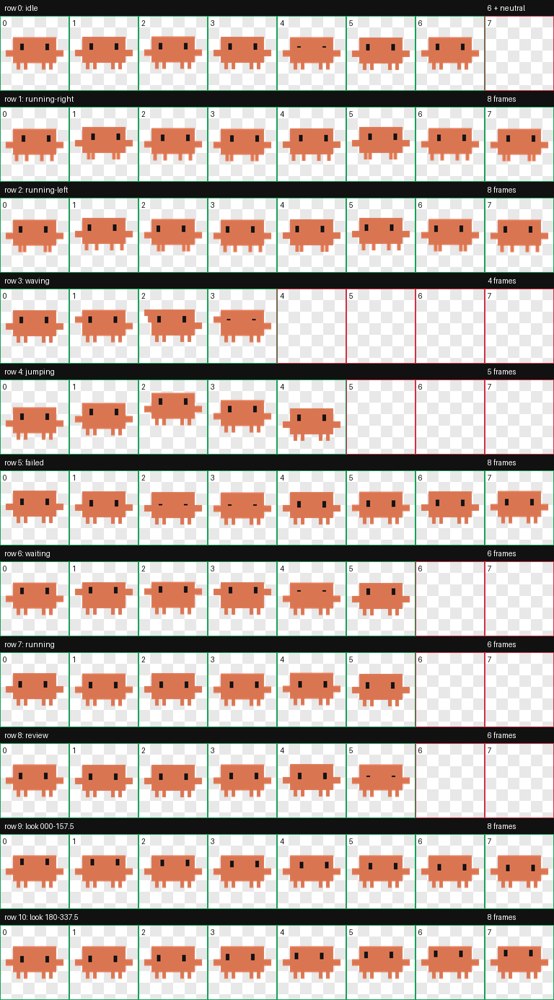

# Claude Code Clawd Codex 桌宠

一个基于 Claude Code 欢迎页三行 Clawd 字符图案制作的 Codex 兼容桌宠。



## 特性

- 严格保留官方三行字符轮廓：`▐▛███▜▌`、`▝▜█████▛▘`、`▘▘ ▝▝`
- 9 个标准动作行和 16 个顺时针视线方向
- 8×11 精灵图，单元尺寸 192×208，图集尺寸 1536×2288
- 透明 WebP，`spriteVersionNumber: 2`
- 不包含文字、阴影、徽记或脱离主体的特效

## 安装

1. 下载 `pet.json` 和 `spritesheet.webp`。
2. 在 Codex 配置目录的 `pets` 下新建 `claude-crab` 文件夹。
3. 将两个文件放入该文件夹，并重新启动 Codex。

Windows 示例目录：

```text
%USERPROFILE%\.codex\pets\claude-crab
```

macOS/Linux 示例目录：

```text
$HOME/.codex/pets/claude-crab
```

## 文件

- `pet.json`：桌宠清单
- `spritesheet.webp`：最终动画图集
- `validation.json`：已匿名化的结构验证结果
- `preview.png`：完整动作联系表
- `SHA256SUMS.txt`：发布文件校验值

## 验证结果

- 图集：1536×2288、RGBA、8×11
- 精灵版本：2
- 结构检查：通过
- 方向盲测：通过
- 独立视觉复核：通过
- 图集 SHA-256：`CB311EA2A95E708E78C5E313E5054D7959E8459CEE10C70AD6756AB6CD664EF0`

本仓库只包含运行桌宠所需的公开发布文件，不包含本机路径、个人邮箱、访问令牌或内部工作记录。
